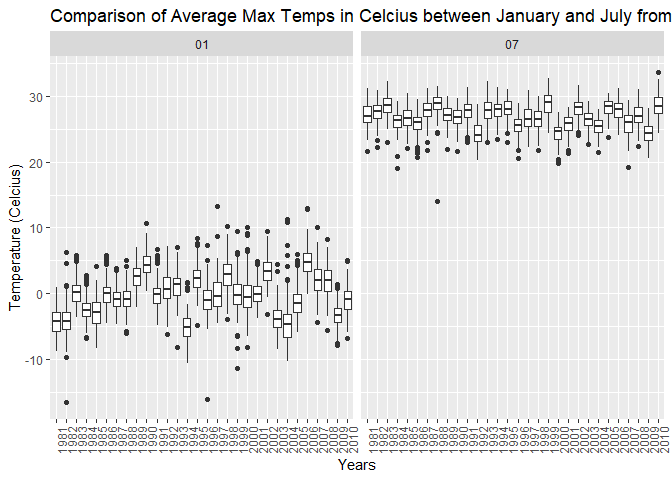
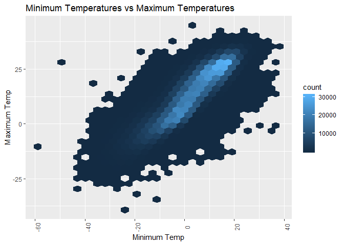

Homework \#3
================
Vincent Tam
October 9, 2018

    ## -- Attaching packages --------------------------------------------------------------------------- tidyverse 1.2.1 --

    ## v ggplot2 3.0.0     v purrr   0.2.5
    ## v tibble  1.4.2     v dplyr   0.7.6
    ## v tidyr   0.8.1     v stringr 1.3.1
    ## v readr   1.1.1     v forcats 0.3.0

    ## -- Conflicts ------------------------------------------------------------------------------ tidyverse_conflicts() --
    ## x dplyr::filter() masks stats::filter()
    ## x dplyr::lag()    masks stats::lag()

    ## 
    ## Attaching package: 'ggridges'

    ## The following object is masked from 'package:ggplot2':
    ## 
    ##     scale_discrete_manual

### Problem 1 - Behavioral Risk Factors Surveillance System (BRFSS) Data

Answers to Homework Questions

    ## # A tibble: 3 x 2
    ##   state     n
    ##   <chr> <int>
    ## 1 CT        7
    ## 2 FL        7
    ## 3 NC        7

In 2002, Connecticut, Floriday, and North Carolina were states observed at 7 locations  "The Spaghetti Plot shows the number of locations in each state from 2002 to 2010. The vast majority of states are observed to have 10 locations or less. A few exceeded 10 but had less than 20. A peak in 2007 shows 40+ locations and a similar 40+ peak was observed in 2010."

    ## # A tibble: 3 x 3
    ##    year brfss_NYexcellentsd brfss_NYexcellentmean
    ##   <int>               <dbl>                 <dbl>
    ## 1  2002                4.49                  24.0
    ## 2  2006                4.00                  22.5
    ## 3  2010                3.57                  22.7

The standard deviations (SD) and means of years 2002, 2006, and 2010, were calculated for the proportions of 'Excellent' responses in NY state. 2002 showed an SD of 4.49 and a mean of 24.04. 2006 had an SD of 4.00 and a mean of 22.53. Year 2010 had an SD of 3.57 and a mean of 22.70. The means and SDs of the three years appear to be similar and consistent.

``` r
brfss_proportions = 
  brfss_data %>%
  group_by(year, state, response) %>%
  summarize(brfss_excellentmean = mean(as.numeric(data_value)), 
            brfss_verygoodmean = mean(as.numeric(data_value)), 
            brfss_goodmean = mean(as.numeric(data_value)),
            brfss_fairmean = mean(as.numeric(data_value)),
            brfss_poormean = mean(as.numeric(data_value))) %>%
  gather(key = cleaned_response, value = proportion, brfss_excellentmean:brfss_poormean) %>% 
  mutate(response = forcats::fct_relevel(response, c("Poor", "Fair", "Good", "Very good", "Excellent"))) 
ggplot(brfss_proportions, aes(x = year, y = proportion, fill = response)) + geom_violin() + facet_grid(~response) + theme(axis.text.x = element_text(angle = 90)) + labs(title = "Average Proportion per Response Category"  )
```

 The side-by-side plots of the response categories: Excellent, Very Good, Good, Fair, and Poor, show relatively consistent distribution in their respective ranges through the years examined. The response Very Good represented the highest proportion of responses every year.

Problem 2 - Instacart Data
--------------------------

    ## [1] 134

    ## # A tibble: 5 x 2
    ##   aisle                           n
    ##   <chr>                       <int>
    ## 1 fresh fruits               150473
    ## 2 fresh vegetables           150609
    ## 3 packaged cheese             41699
    ## 4 packaged vegetables fruits  78493
    ## 5 yogurt                      55240

There are 134 different aisles. The top five aisles where the most food are ordered from, are:
1. Fresh Vegetables 2. Fresh Fruites 3. Packaged Vegetables Fruits 4. Yogurt 5. Packaged Cheese
 The plot above shows approximately 150,000+ items stocked in the aisles in the dataset. Fresh Vegetables, Aisle 83 hold the most items while Beauty, Aisle 132, contains the least.

    ## Selecting by n

| aisle                         | product\_name                                   |                                                                                                                                                                                                                                                                   n|
|:------------------------------|:------------------------------------------------|-------------------------------------------------------------------------------------------------------------------------------------------------------------------------------------------------------------------------------------------------------------------:|
| packaged vegetables fruits    | Organic Baby Spinach                            |                                                                                                                                                                                                                                                                9784|
| baking ingredients            | Light Brown Sugar                               |                                                                                                                                                                                                                                                                 499|
| dog food care                 | Snack Sticks Chicken & Rice Recipe Dog Treats   |                                                                                                                                                                                                                                                                  30|
| The table above shows the mos | t popular items for their respective aisles. In |  Packaged Vegetables Fruits, Organic Baby Spinach had 9784 orders, 20x more than the most popular Baking Ingredient, Light Brown Sugar (499 orders). Meanwhile, Dog Food Care's most popular item is Snack Sticks Chicken & Rice Recipe Dog Treats, with 30 orders.|

| order\_dow     |     Coffee Ice Cream|                                                                                                                                                                                                                                                   Pink Lady Apples|
|:---------------|--------------------:|------------------------------------------------------------------------------------------------------------------------------------------------------------------------------------------------------------------------------------------------------------------:|
| Sunday         |                 13.8|                                                                                                                                                                                                                                                               13.4|
| Monday         |                 14.3|                                                                                                                                                                                                                                                               11.4|
| Tuesday        |                 15.4|                                                                                                                                                                                                                                                               11.7|
| Wednesday      |                 15.3|                                                                                                                                                                                                                                                               14.2|
| Thursday       |                 15.2|                                                                                                                                                                                                                                                               11.6|
| Friday         |                 12.3|                                                                                                                                                                                                                                                               12.8|
| Saturday       |                 13.8|                                                                                                                                                                                                                                                               11.9|
| The table ab   |  ove shows the avera|  ge time of day where people order pink-lady apples and coffee ice cream is generally during mid-day. However, coffee ice cream is ordered the latest on Tues, Wed, and Thurs. Pink-lady apples This habit appears to tend to be ordered the latest on Wednesdays.|
| \#\# Problem 3 |   - New York NOAA Da|                                                                                                                                                                                                                                                                 ta|

``` r
data(ny_noaa)
```

``` r
nynoaa_cleaned = 
  ny_noaa %>% 
  janitor::clean_names() %>%
  separate(date, into = c("year", "month", "day"), sep = "-") %>% 
  mutate(tmin = as.numeric(tmin)/10, tmax = as.numeric(tmax)/10)
```

``` r
nynoaa_snow = 
  nynoaa_cleaned %>%
  group_by(snow) %>%
  summarize(n = n()) %>%
  top_n(3)
```

    ## Selecting by n

``` r
nynoaa_snow
```

    ## # A tibble: 3 x 2
    ##    snow       n
    ##   <int>   <int>
    ## 1     0 2008508
    ## 2    25   31022
    ## 3    NA  381221

``` r
maxtempJanJul_plot =
  nynoaa_cleaned %>%
  na.omit() %>%
  select(year, month, id, tmin, tmax) %>%
  filter(month == "01" | month == "07") %>%
    group_by(year, month, id) %>%
  summarize(tmax_mean = mean(tmax)) %>%
  ggplot(aes(x = year, y = tmax_mean)) + geom_boxplot() + facet_grid(.~month) + theme(axis.text.x = element_text(size = 9, angle = 90)) + labs(title = "Comparison of Average Max Temps in Celcius between January and July from 1981 to 2010", x = "Years", y = "Temperature (Celcius)" )
maxtempJanJul_plot
```



``` r
plot1_minmax =
  nynoaa_cleaned %>%
  na.omit() %>%
  select(tmin, tmax) %>%
  ggplot(aes(x = tmin, y = tmax )) + geom_hex() + labs(title = "Minimum Temperatures vs Maximum Temperatures", x = "Minimum Temp", y = "Maximum Temp") + theme(axis.text.x = element_text(size = 9, angle = 90))
plot1_minmax
```


``` r
plot2_snowfall =
  nynoaa_cleaned %>%
  na.omit() %>%
  filter(snow > 0 & snow < 100) %>%
  ggplot(aes(x = year, y = snow )) + geom_boxplot() + labs(title = "Distribution of Snowfall Values by Years", x = "Year", y = "Snowfall Valuesp") + theme(axis.text.x = element_text(size = 9, angle = 90))
plot2_snowfall
```


